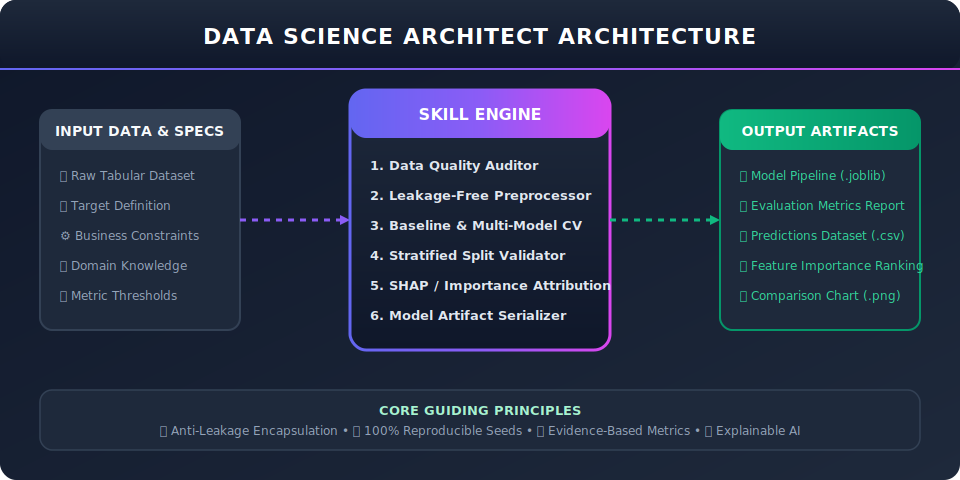
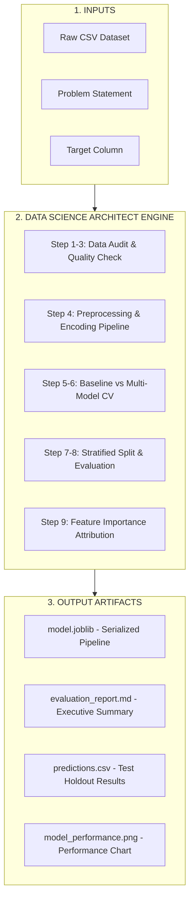

# Data Science Architect

<div align="center">



[](LICENSE)
[](requirements.txt)
[](tests/)
[](CONTRIBUTING.md)

**A reusable AI Skill framework that guides AI agents and data scientists through reliable, reproducible, and explainable Machine Learning workflows.**

[Key Features](#key-features) • [11-Step Workflow](#11-step-ml-workflow) • [Architecture](#system-architecture) • [Quickstart](#quickstart) • [Skill Library](#skill-library-structure) • [Contributing](#contributing)

</div>

---

## 💡 Overview

Many machine learning projects suffer from **data leakage**, **unreliable baseline metrics**, **unreproducible random seeds**, or **ad-hoc modeling scripts** that fail when deployed.

**Data Science Architect** bridges this gap by providing an end-to-end, agentic skill specification and automated Python execution framework. It enforces strict data hygiene, systematic model comparison, cross-validation discipline, and explainable output generation.

---

## ⚡ Key Features

- 🛡️ **Leakage-Free Pipelines**: Strict separation of fit and transform steps across train, validation, and test splits using scikit-learn `Pipeline` and `ColumnTransformer`.
- 🔍 **Automated Data Quality Audit**: Pre-flight checks for missingness patterns, constant features, high cardinality, duplicates, and class imbalance.
- 📊 **Multi-Model Comparison**: Evaluates baseline models against tree ensembles (Random Forest, Extra Trees, Gradient Boosting) using unified cross-validation.
- 🎯 **Domain-Centric Metrics**: Supports Stratified K-Fold CV, F1-Score, ROC-AUC, Balanced Accuracy, R² Score, RMSE, and MAE.
- 🔍 **Model Explainability**: Automated feature importance attribution and decision visualization.
- 📦 **Production Artifact Packaging**: Exports trained pipeline binaries (`.joblib`), evaluation matrices (`.md`), predictions (`.csv`), and performance charts (`.png`).

---

## 🏗️ System Architecture



---

## 🔄 11-Step ML Workflow

```
[1. Understand Task] ➔ [2. Inspect Dataset] ➔ [3. Quality Assessment] ➔ [4. Feature Engineering]
                                                                                     │
[8. Hyperparameter Opt.] ── [7. Validation Strategy] ── [6. Model Comparison] ── [5. Baseline Model]
        │
        ▼
[9. Interpretation & Insights] ➔ [10. Final Model & Predictions] ➔ [11. Report & Recommendations]
```

### Before vs. After Workflow Comparison

| Metric / Aspect | ❌ Ad-hoc Approach (Before) | ✅ Data Science Architect (After) |
| :--- | :--- | :--- |
| **Data Hygiene** | Scalers fitted on entire dataset prior to splitting (Leakage!) | Fit/Transform strictly isolated inside CV folds |
| **Baseline Setup** | Jumped straight to complex neural net or XGBoost | Established simple baseline first (Logistic / Ridge) |
| **Validation** | Single train/test split (High variance) | Stratified K-Fold / Time-Series Cross Validation |
| **Reproducibility** | Missing or inconsistent random seeds | Guaranteed fixed `random_state=42` across pipeline |
| **Model Selection** | Chosen subjectively | Data-driven ranking on out-of-fold metrics |
| **Packaging** | Jupyter notebook cells without saved models | Serialized scikit-learn `.joblib` pipeline binary |

---

## 🚀 Quickstart

### 1. Installation

Clone the repository and install dependencies:

```bash
git clone https://github.com/saitejabandaru-in/data-science-architect.git
cd data-science-architect

# Create virtual environment
python3 -m venv venv
source venv/bin/activate  # On Windows: venv\Scripts\activate

# Install requirements
pip install -r requirements.txt
```

### 2. Run Data Quality Audit

Inspect any dataset for anomalies, missing values, and class imbalance:

```bash
python skills/data-science-architect/scripts/validate_data.py --dataset examples/sample_dataset.csv --target churn
```

### 3. Execute End-to-End Workflow

Run the complete 11-step pipeline on the included synthetic customer dataset:

```bash
python skills/data-science-architect/scripts/workflow.py --dataset examples/sample_dataset.csv --target churn --output-dir outputs/
```

Output generated in `outputs/`:
- 📦 `model.joblib`: Serialized inference pipeline
- 📈 `evaluation_report.md`: Markdown summary of cross-validation metrics
- 📋 `predictions.csv`: Model predictions on holdout test set
- 📊 `feature_importance.csv`: Feature ranking table
- 📉 `model_performance.png`: Model comparison bar chart

---

## 📁 Skill Library Structure

```
data-science-architect/
├── README.md                      # Main project documentation
├── LICENSE                        # MIT License
├── CONTRIBUTING.md                # Contribution guidelines
├── CODE_OF_CONDUCT.md             # Community standards
├── requirements.txt               # Dependencies
├── .github/workflows/ci.yml       # GitHub Actions CI workflow
├── assets/                        # SVG architecture diagrams
│   └── architecture.svg
├── skills/
│   └── data-science-architect/
│       ├── SKILL.md               # Core AI Skill specification & directives
│       ├── references/            # Deep-dive technical guides
│       │   ├── ml_workflow.md         # 11-step pipeline guide
│       │   ├── feature_engineering.md # Preprocessing & encoding reference
│       │   ├── model_evaluation.md    # Metrics & CV strategies
│       │   ├── data_quality.md        # Data audit protocols
│       │   └── deployment.md          # Packaging & monitoring guide
│       └── scripts/               # Executable Python tools
│           ├── workflow.py            # End-to-end ML workflow runner
│           └── validate_data.py       # Standalone dataset auditor
├── examples/                      # Runnable examples
│   ├── sample_dataset.csv             # Synthetic customer dataset
│   ├── customer_churn_prediction.py   # Classification example
│   └── housing_price_regression.py    # Regression example
└── tests/                         # Pytest suite
    └── test_workflow.py
```

---

## 🧪 Testing & Verification

Run the automated test suite with `pytest`:

```bash
pytest tests/
```

Run classification and regression example pipelines:

```bash
python examples/customer_churn_prediction.py
python examples/housing_price_regression.py
```

---

## 📄 License

This project is licensed under the [MIT License](LICENSE) - see the LICENSE file for details.

---

## 🤝 Contributing

Contributions are welcome! Please read the [Contributing Guide](CONTRIBUTING.md) to get started.

<div align="center">
Created with ❤️ by <a href="https://github.com/saitejabandaru-in">Sai Teja Bandaru</a>
</div>
